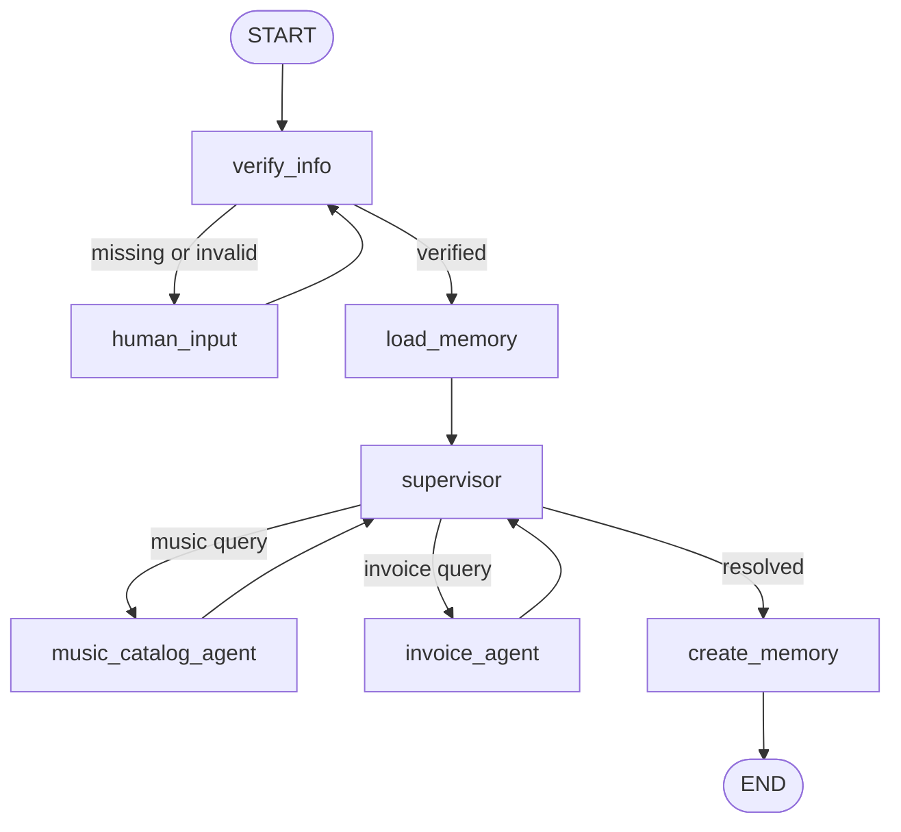

# Music Store Agent

A multi-agent customer support system for a digital music store, built with **LangGraph** and **LangChain** on top of the [Chinook](https://github.com/lerocha/chinook-database) sample database. It answers questions about the music catalog and a customer's invoices, verifies the customer's identity before sharing account data, and remembers each customer's music taste across sessions.

Built as a course project for the Generative AI Diploma at Edges Academy.

## What it does

- **Verifies the customer** by email, phone number, or customer ID before answering any account-specific question, pausing to ask for it if it's missing or doesn't match a record.
- **Routes queries** between two specialist agents through a supervisor: a music catalog agent (albums, tracks, genres, song availability) and an invoice agent (purchase history, totals, support contact).
- **Remembers music preferences** across separate conversations, using a long-term memory store keyed to the customer, and uses them to personalize recommendations.
- **Filters what it remembers** with a small LLM-based classifier, so only genuine music-taste statements are saved — not every message the customer sends.

## Architecture



| Node | Responsibility |
|---|---|
| `verify_info` | Extracts an email, phone, or customer ID from the message and resolves it to a `customer_id`. Routes onward once verified. |
| `human_input` | Pauses the graph (`interrupt()`) and asks the customer for identifying info when verification fails. |
| `load_memory` | Loads any saved music preferences for the customer and injects them into context. |
| `supervisor` | A LangGraph supervisor agent that delegates each query to the right specialist(s) and combines their answers. |
| `music_catalog_agent` | A ReAct agent with tools over the `Album`, `Track`, `Artist`, and `Genre` tables. |
| `invoice_agent` | A ReAct agent with tools over the `Invoice`, `Customer`, and `Employee` tables. |
| `create_memory` | Extracts any new music preference from the conversation (via a structured-output LLM call) and saves it if it isn't already known. |

Short-term memory (conversation history, within one session) is handled by a `MemorySaver` checkpointer keyed on `thread_id`. Long-term memory (preferences, across sessions) is handled by an `InMemoryStore` keyed on `customer_id`.

## Tech stack

- [LangGraph](https://langchain-ai.github.io/langgraph/) — state graph, checkpointing, long-term memory store, human-in-the-loop interrupts
- [LangChain](https://python.langchain.com/) — tool definitions, ReAct agents
- [langgraph-supervisor](https://github.com/langchain-ai/langgraph-supervisor-py) — supervisor multi-agent pattern
- [Groq](https://groq.com/) (`openai/gpt-oss-20b`) — LLM inference
- SQLAlchemy + SQLite (in-memory) — the Chinook sample database

## Getting started

### Prerequisites

- Python 3.11+
- A [Groq API key](https://console.groq.com/keys)

### Setup

```bash
git clone https://github.com/mohamedhisham51/music-store-agent.git
cd music-store-agent
python -m venv venv
source venv/bin/activate  # on Windows: venv\Scripts\activate
pip install -r requirements.txt
```

Create a `.env` file in the project root with your API key:

```
GROQ_API_KEY=your_key_here
```

The notebook loads this automatically; if no `.env` is found, it will prompt for the key instead.

### Running

Open `music_store.ipynb` in Jupyter and run the cells top to bottom. The notebook:

1. Downloads the Chinook SQL script and loads it into an in-memory SQLite database — no external database setup needed.
2. Builds the two specialist agents, the supervisor, and the full LangGraph graph.
3. Exposes a small `chat(app, config, message)` helper that drives the conversation — it transparently handles both sending a new message and resuming a paused (interrupted) conversation.
4. Runs example conversations, including the identity-verification flow and memory persistence across sessions.

## Example interaction

```python
config = new_session()
print(chat(app, config, "My phone number is +55 (12) 3923-5555. How much was my most recent purchase? What albums do you have by the Rolling Stones?"))
```
```
Your most recent purchase (Invoice 382) was for $8.91 on 2025-08-07.

Here are the Rolling Stones albums we have in our catalog:
1. Hot Rocks, 1964-1971 (Disc 1)
2. No Security
3. Voodoo Lounge
```

If the customer isn't identified yet, the graph pauses and asks for it instead of guessing or refusing outright:

```python
config = new_session()
print(chat(app, config, "What albums do you have by AC/DC?"))
# -> "Please provide your Customer ID, email, or phone number."

print(chat(app, config, "5"))
# -> resumes the same conversation with the resolved customer_id
```

## Design notes

A few deliberate simplifications, given this is a learning project built under a time constraint:

- The project is intentionally kept to a **single notebook** rather than a multi-file package, per the course deliverable requirements.
- Catalog lookups use SQL `LIKE` matching (e.g. `"Rolling Stones"` matches `"The Rolling Stones"`) rather than exact matches, since customers rarely phrase artist names exactly as stored.
- Preference deduplication is handled by asking the LLM whether a new statement is already covered by existing preferences, rather than a strict string match — this catches paraphrases but is probabilistic rather than guaranteed.
- `customer_id` is passed to the specialist agents as plain context in the message history rather than via LangGraph's injected-state tool pattern, which is simpler but relies on the LLM supplying it correctly rather than enforcing it structurally.

## Acknowledgments

Built on the [Chinook sample database](https://github.com/lerocha/chinook-database).
